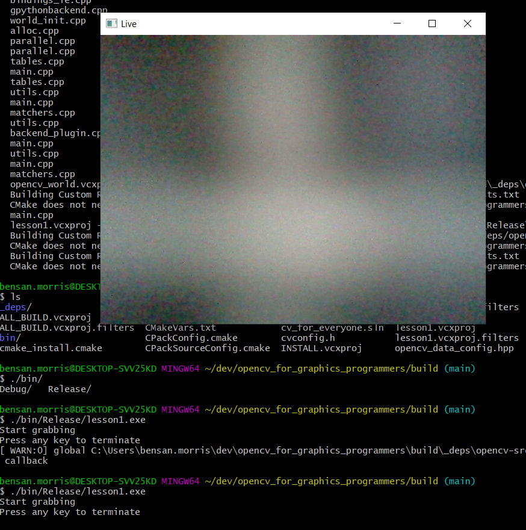

# TLDR

A course on OpenCV for everyone with an emphasis on performance and optimisation.

# Prerequisites

(Linux - Ubuntu 18.04)

- gtk: `sudo apt-get install libgtk2.0-dev`
- CMake: `sudo apt-get install cmake`
- gcc: `sudo apt-get install build-essential`
- git: `sudo apt-get install git`

(Windows)

- [CMake](https://cmake.org/download/)
- Visual Studio 2017

# Lesson 1 - Building OpenCV
Let's build a minimal OpenCV and a small test application that will activate your laptop's camera and start grabbing video frames:

Linux:
```
git clone https://github.com/bensanmorris/opencv_for_graphics_programmers.git
cd opencv_for_graphics_programmers
cmake -G "Unix Makefiles" -B build .
cd build
cmake --build . --config Release
./bin/lesson1
```
Windows:
```
git clone https://github.com/bensanmorris/opencv_for_graphics_programmers.git
cd opencv_for_graphics_programmers
cmake -B build -G "Visual Studio 15 2017" -A x64 .
cd build
cmake --build . --config Release
./bin/Release/lesson1
```
If all goes well you should see a window displaying your webcam output:



The OpenCV library build is customisable. Above we built what is referred to as a "static" build of OpenCV (as opposed to dynamic). This means that the OpenCV library routines are built into our OpenCV applications for ease of portability. In future lessons (when we look at combining OpenCV and Tensorflow, we will be using a dynamic build of OpenCV which is controlled via the OpenCV build option BUILD_SHARED_LIBS and associated rpath issues - rpath being the mechanism through which an executable locates its shared libraries on linux). If you want to explore OpenCV build options and play with them then simply:
```
grep -lr OCV_OPTION *
```

And then add the option and its value to the top of this lesson's CMakeLists.txt file eg:
```
set(BUILD_SHARED_LIBS ON)
```
